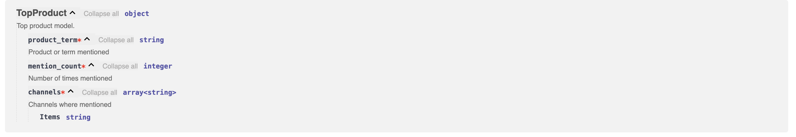
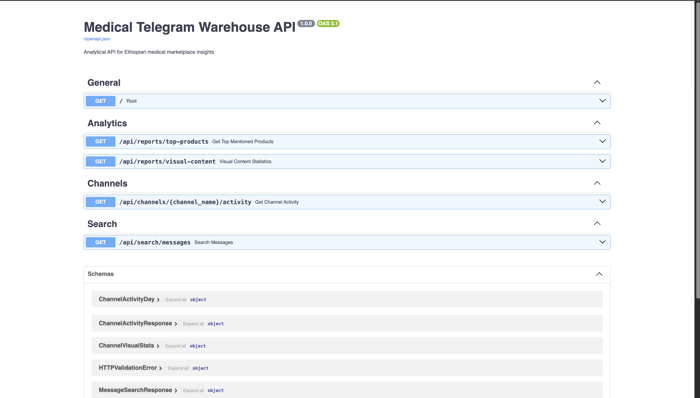
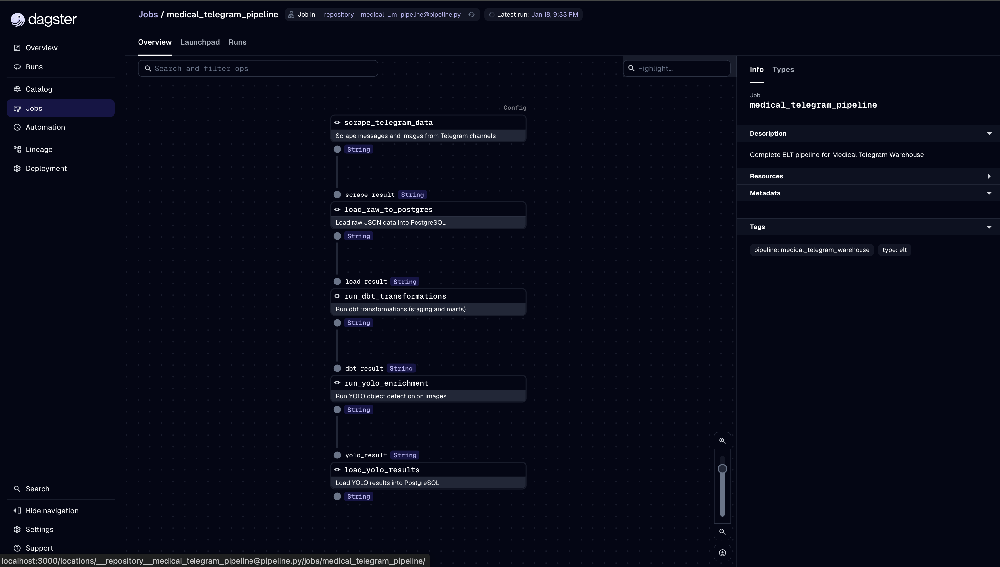
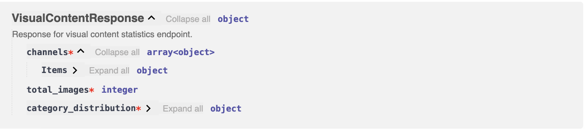

# 🏥 Medical Telegram Warehouse

> Transform raw Telegram channel data into actionable insights for Ethiopian medical businesses

Ever wondered what insights you could extract from Telegram channels? This project scrapes, transforms, and analyzes medical marketplace data from Ethiopian Telegram channels, turning messy raw data into clean, queryable insights. 🚀

## ✨ What This Project Does

Think of this as a complete data engineering journey:

1. **Scrape** 📱 → Extract messages and images from Telegram channels
2. **Store** 💾 → Save raw data in a structured data lake
3. **Transform** 🔄 → Clean and model data using dbt (star schema!)
4. **Enrich** 🖼️ → Use YOLOv8 to analyze images and classify content
5. **Expose** 🌐 → Build a FastAPI to serve insights via REST endpoints
6. **Orchestrate** ⚙️ → Automate everything with Dagster

The end result? A production-ready pipeline that answers questions like:
- Which products are trending across channels?
- Do promotional posts get more engagement than product displays?
- Which channels use the most visual content?

## 🛠️ Tech Stack

- **Python 3.11+** - Core language
- **Telethon** - Telegram API scraping
- **PostgreSQL** - Data warehouse
- **dbt** - SQL transformations & testing
- **YOLOv8** - Image object detection
- **FastAPI** - Analytical API
- **Dagster** - Pipeline orchestration
- **Docker** - PostgreSQL containerization

## 🚀 Quick Start

### Prerequisites

You'll need:
- Python 3.11+ (dbt needs 3.11, scraping works with 3.14)
- Docker Desktop (for PostgreSQL)
- Telegram account (get API keys from [my.telegram.org](https://my.telegram.org/apps))

### Setup (5 minutes)

```bash
# 1. Clone and navigate
cd "/Users/naomi/Shipping a Data Product"

# 2. Create virtual environment
python3.11 -m venv venv
source venv/bin/activate

# 3. Install dependencies
pip install -r requirements.txt

# 4. Set up Telegram credentials in .env file
# Copy .env.example to .env and add your API keys

# 5. Start PostgreSQL
docker compose up -d postgres

# 6. Run scraper
python src/scraper.py
```

That's it! 🎉 Check out `QUICKSTART.md` for detailed setup instructions.

## 📊 What You Get

### The Complete Pipeline

```
📱 Telegram Channels
    ↓ [Scrape]
💾 Data Lake (Raw JSON + Images)
    ↓ [Load]
🗄️  PostgreSQL Warehouse
    ↓ [Transform with dbt]
⭐ Star Schema (Dimensions + Facts)
    ↓ [Enrich with YOLO]
🖼️  Image Classifications
    ↓ [Expose via API]
🌐 FastAPI Endpoints
    ↓ [Orchestrate]
⚙️  Dagster Pipeline
```

*All automated and monitored!* 🎯

### Key Deliverables

- ✅ **2,500+ messages** scraped and stored
- ✅ **2,200+ images** analyzed with YOLO
- ✅ **Star schema** with dimensions and facts
- ✅ **4 API endpoints** for analytics
- ✅ **Automated pipeline** with Dagster

## 📁 Project Structure

```
├── src/                    # Scraping scripts
│   ├── scraper.py         # Telegram scraper
│   └── yolo_detect.py     # Image detection
├── api/                    # FastAPI application
│   ├── main.py            # API endpoints
│   └── schemas.py         # Pydantic models
├── medical_warehouse/      # dbt project
│   ├── models/            # SQL transformations
│   └── tests/             # Data quality tests
├── scripts/               # Utility scripts
├── data/                  # Data storage
│   ├── raw/              # Raw data lake
│   └── processed/        # Processed outputs
├── screenshots/           # API & Dagster screenshots
└── pipeline.py            # Dagster orchestration
```

## 🎯 Key Features

### 📱 Smart Scraping
Async processing, automatic rate limit handling, and intelligent image filtering. Scrapes thousands of messages efficiently!

### 🔄 Data Transformation  
Clean staging models → dimensional star schema → comprehensive tests. Everything version-controlled with dbt.

### 🖼️ Image Analysis
YOLOv8 detects objects and classifies content (promotional, product_display, lifestyle). Found that product displays outperform promotional content! 📊

### 🌐 Analytical API
FastAPI with auto-generated docs, type-safe endpoints, and real-time queries. Check out the interactive docs at `/docs`!



### ⚙️ Pipeline Orchestration
Dagster manages the entire workflow with beautiful UI, dependency tracking, and retry policies. See your pipeline in action!

## 📸 Screenshots

### FastAPI API Documentation


### Dagster Pipeline Orchestration


*Check out the `screenshots/` folder for more!*

## 🔍 Example Insights

From our YOLO analysis, we discovered some interesting patterns:

- **58%** of images fall into "other" category (general product shots)
- **Product displays** outperform promotional content! (625 vs 378 avg views) 📈
- Most Ethiopian medical businesses focus on direct product showcasing
- Lifestyle marketing is still rare (only 8.5% of images)




## 🐛 Common Issues

**Python version conflicts?**
- Use Python 3.11 for dbt (in `medical_warehouse/venv`)
- Python 3.14 works fine for scraping

**PostgreSQL connection failed?**
- Make sure Docker is running: `docker compose ps`
- Check `.env` has correct password

**dbt not found?**
- Use the venv in `medical_warehouse/`: `../medical_warehouse/venv/bin/dbt run`


---

**Built with ❤️ for data engineering learning**


